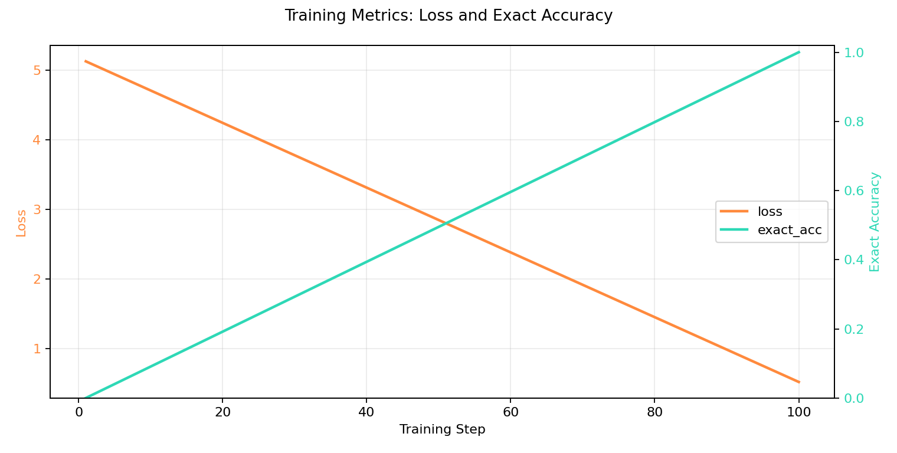

# Summation Transformer

This repository explores multiple decoder-style architectures for exact 10-digit addition, from hardcoded symbolic models to trainable compact transformer variants.

[](https://colab.research.google.com/github/Deferf/Summation-Transformer/blob/main/colab_train_strictish_h2_d6_singlecarry.ipynb)

## Key Result: 163 Trainable Weights

The strongest compact trainable variant currently reaches exact 10-digit addition with only **163 trainable weights**:

- script: `train_strictish_h2_d6_singlecarry_from_scratch.py`
- architecture: `n_heads=2`, `d_model=6`, `mlp_hidden=1`
- trainable layers only: Q/K/V/O projections + narrow MLP

Parameter breakdown (`163` total):
- attention projections: `4 x (6 x 6) = 144`
- MLP first layer: `(6 x 1) + 1 = 7`
- MLP second layer: `(1 x 6) + 6 = 12`
- total: `144 + 7 + 12 = 163`

## Problem Setup

All models use fixed-width addition of two numbers in `[0, 10^10)` and predict an 11-digit sum.

Core token design used across most files:
- `X[d1,d2]`: pair token for one digit column (LSD-first)
- `Y[d,c]`: output token where `d` is output digit and `c` is carry bit

Sequence format (LSD-first internals):

`[BOS] X0 X1 ... X9 [C0] Y0 Y1 ... Y10 [EOS]`

## Methods Implemented

### 1) Third-Order Optimized Transformer Training

- Files: `train_addition.py`, `third_order_optimizer.py`, `model.py`, `addition_data.py`
- Trains a decoder-only transformer for 10-digit addition.
- Uses a directional third-order trust-region optimizer:
  - random probe directions
  - directional 1st/2nd/3rd derivatives
  - trust-region acceptance ratio and adaptive regularization
  - multi-start + basin hopping global search

### 2) Hardcoded Minimal Arithmetic Models

- `hardcoded_minimal_transformer.py`:
  hardcoded routing + lookup-table style full-adder behavior.
- `minimal_phase_transformer.py`:
  near-zero-parameter arithmetic decoder using unit-circle phase representation.
- `minimal_phase_transformer_diagram.md`:
  architecture explanation for the phase model.

### 3) Strict / Strict-ish Transformer Variants

- `strict_hardcoded_transformer.py`:
  explicit Q/K/V/O + MLP, hardcoded weights.
- `strictish_sub300_transformer.py`:
  compact transformer-style model with algorithmic/factorized embedding and decoding.
- `train_strictish_sub300_from_scratch.py`:
  self-contained scratch training for the sub-300 variant.
- `train_strictish_h2_d4_from_scratch.py`:
  smaller `n_heads=2`, `d_model=4` trainable variant.
- `train_strictish_h2_d6_singlecarry_from_scratch.py`:
  no pre-summed leakage features, raw digit channels + single carry channel, trainable from scratch.
  **Current compact milestone: 163 trainable weights.**

### 4) Visualization

- `interactive_strictish_sub300_visualizer.html`:
  interactive web visualization of the token-to-output transformation pipeline.

### 5) Google Colab Runner

- `colab_train_strictish_h2_d6_singlecarry.ipynb`:
  runnable Colab notebook for `train_strictish_h2_d6_singlecarry_from_scratch.py`.
  It stores artifacts in `/content/outputs` to avoid local-only paths such as `checkpoints/`.
- `build_colab_notebook.py`:
  generates the notebook via `nbformat` so cell formatting remains valid and reproducible.

Regenerate notebook after edits:

```bash
python build_colab_notebook.py
```

## Training Plot (Loss + Exact Accuracy)

Example output from:

`train_strictish_h2_d6_singlecarry_from_scratch.py --mlp-hidden 1`



## Quickstart

Create and activate a virtual environment:

```bash
python3 -m venv .venv
source .venv/bin/activate
pip install -r requirements.txt
```

Run one of the training scripts:

```bash
python train_strictish_h2_d6_singlecarry_from_scratch.py --device cpu
```

## AdderBoard Verification

This repo includes an AdderBoard-compatible submission file:

- `adderboard_submission.py`

Run the verifier end-to-end:

```bash
source .venv/bin/activate
git clone https://github.com/anadim/AdderBoard.git /tmp/AdderBoard
python /tmp/AdderBoard/verify.py adderboard_submission.py --seed 2025 --num-tests 10000
```

What the verifier does:

- imports `adderboard_submission.py`
- calls `build_model()` once
- runs fixed edge cases plus random test pairs
- calls `add(model, a, b)` for each pair
- reports accuracy, throughput, and qualification (`>= 99%`)

Useful options:

- use fewer random tests for a quick smoke check:
  `python /tmp/AdderBoard/verify.py adderboard_submission.py --num-tests 200 --seed 2025`
- keep official leaderboard settings:
  `--seed 2025 --num-tests 10000`

Run the visualizer by opening:

`interactive_strictish_sub300_visualizer.html`

## Notes

- Some scripts are intentionally hardcoded to demonstrate mechanistic arithmetic behavior.
- The compact trainable variants show that exact addition can be recovered from scratch with very small models.
