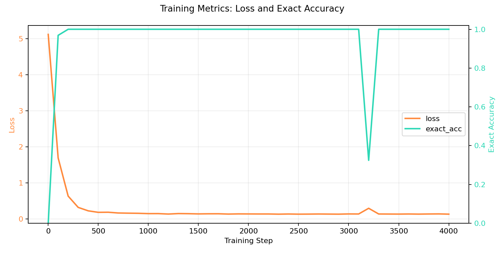

# Summation Transformer (37-Parameter Edition)

This repository is focused on a single compact model for exact 10-digit addition: a **37-trainable-parameter** spectral decoder-style transformer.

[](https://colab.research.google.com/github/Deferf/Summation-Transformer/blob/main/colab_train_strictish_h2_d6_singlecarry.ipynb)

## Model Summary

- task: add two numbers in `[0, 10^10)` and produce an 11-digit result
- sequence format: `[BOS] X0..X9 [C0] Y0..Y10 [EOS]` (LSD-first internally)
- pair tokenization:
  - `X[d1,d2]` for each input digit column
  - `Y[d,carry]` for each output column
- architecture:
  - `n_heads=2`, `d_model=6`
  - spectral Q/K/V/O projections with fixed DCT-like basis + trainable diagonals
  - tiny MLP (`6 -> 1 -> 6`) with inner bias on, outer bias off

### Parameter Breakdown (37 total)

- attention spectral scales: `q(6) + k(6) + v(6) + o(6) = 24`
- MLP first layer: `(1 x 6) + 1 = 7`
- MLP second layer: `(6 x 1) = 6`
- total: `24 + 7 + 6 = 37`

`digit_basis`, `spectral_basis`, and routing bias are fixed buffers and are not trainable.

## Repository Layout

- `train_strictish_h2_d6_singlecarry_from_scratch.py`
  - training/evaluation script for the 37-parameter family
- `adderboard_submission.py`
  - **self-contained** AdderBoard submission implementation with embedded 37 trained weights
- `colab_train_strictish_h2_d6_singlecarry.ipynb`
  - Colab runner for training + verifier + inference
- `build_colab_notebook.py`
  - deterministic notebook generator (`nbformat`)
- `assets/strictish_h2_d6_37_metrics.png`
  - reference training plot

## Training

```bash
python3 -m venv .venv
source .venv/bin/activate
pip install -r requirements.txt

python train_strictish_h2_d6_singlecarry_from_scratch.py \
  --device cpu \
  --steps 4000 \
  --batch-size 256 \
  --lr 0.02 \
  --mlp-hidden 1 \
  --mlp-bias-inner \
  --spectral-qkv \
  --spectral-o \
  --log-every 100 \
  --eval-samples 256 \
  --final-eval-samples 2000 \
  --target-acc 1.1
```

## AdderBoard Verification

```bash
source .venv/bin/activate
git clone https://github.com/anadim/AdderBoard.git /tmp/AdderBoard
python /tmp/AdderBoard/verify.py adderboard_submission.py --seed 2025 --num-tests 10000
```

Quick smoke test:

```bash
python /tmp/AdderBoard/verify.py adderboard_submission.py --seed 2025 --num-tests 200
```

## Colab

The notebook runs:

1. environment setup in `/content/Summation-Transformer`
2. training of the 37-parameter spectral model
3. AdderBoard verifier (`verify.py`) with saved log in `/content/outputs`
4. interactive inference with step-wise logits

Regenerate the notebook after edits:

```bash
python build_colab_notebook.py
```

## Training Plot


